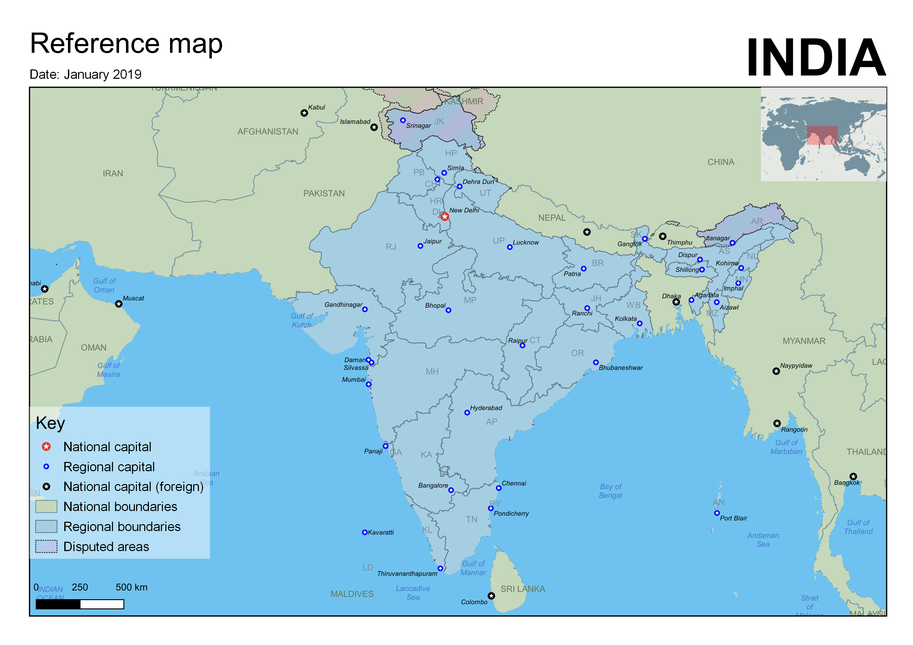

A reference map of India, made using QGIS and [Natural Earth](http://naturalearthdata.com/) data. 

Loosely based on a UN reference map. This one shows Kashmir as a disputed region (the original left Kashmir off). 

I should really have included a list of the abbreviations used for states, perhaps on the right of the page.
