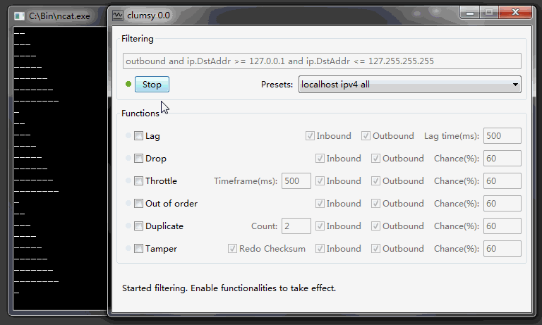

Recently I was making a webmap for a colleague working in Haiti that contained a few large layers. I was aware that where they would be using the map, they would have poor internet and the map's loading and performance on my UK wifi connection wasn't a fair representation of how it would feel to use.

Chrome's developer panel [allows you](https://www.hanselman.com/blog/how-to-simulate-a-low-bandwidth-connection-for-testing-web-sites-and-applications) to simulate *slow* connections but this isn't the only issue that leads to degraded performance in loading pages and data. Poor quality connections can lead to errors and corruption in data transfer that just slowing down the transfer speed doesn't account for. 

[This Stack Exchange answer](https://stackoverflow.com/a/29936607) helped me find a tool called [clumsy](http://jagt.github.io/clumsy/index.html) that did exactly what I needed. You can simulate (and fine tune) packet loss, latency, throttling, and various other parameters to simulate an unreliable internet connection. 

From the description: "Though nowadays it seems everybody have high speed broadband Internet connection, it's still important to face the fact that network transportation isn't always reliable. You don't want a duplicated UDP packet to crash your application. Properly handle this usually requires adding more code in their projects, and it's not always easy nor possible. Hopefully clumsy can provide an easy and painless (though suboptimal) option to do this for busy developers."

After testing the webmap with this tool I turned off the heaviest layers by default, changed others to only display at higher zoom levels, and limited panning to the extent of the island to prevent tiles being loaded unncessarily.
