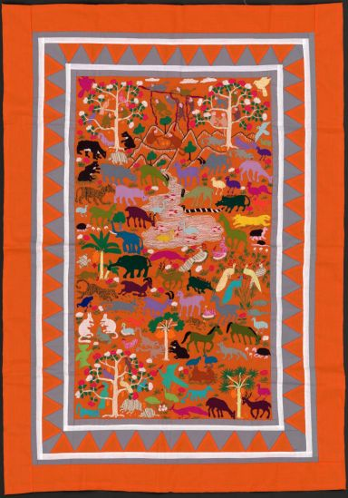

A find from the US [Library of Congress map collection](https://www.loc.gov/resource/g8001e.ct007688a/?r=-0.824,-0.09,2.648,1.609,0). From the item page: "Pictorial story cloth maps describing culture and history of the Hmong people, an Asian ethnic group in Southeast Asia."
