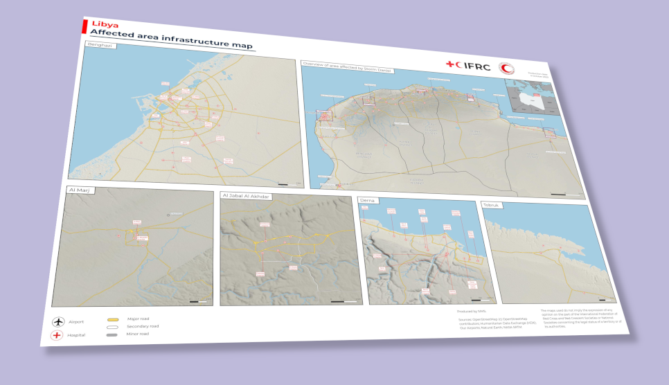

Most of the maps I make for work can't be made public, but I recently made a map for the IFRC's surge support team that has been [made public](https://rcrcsims.org/portfolio/view/23). The surge support team was responding to [flooding in Libya caused by Storm Daniel](https://go.ifrc.org/emergencies/6647/details) in September 2023. This was a quick turnaround - from memory about 24 hours from receiving the task to submitting the final version, with a couple of quick rounds of edits. About 70% of the time I spent on it was gathering and cleaning data, 30% on styling and layout. 

The map shows key infrastructure in the area affected by the storm: roads, airports, hospitals and rivers - mostly from OpenStreetMap / Humanitarian Data Exchange. I added terrain from NASA SRTM elevation data - I posted about that separately [here](https://ioalexei.github.io/cartography/2023/10/25/shaded-relief-in-qgis.html). 

The OSM hospitals data was supplemented by a list of hospitals from local partners which I ran through Google Translate to get the names in English. The OSM health site data is a bit messy so I chose to show all features tagged as `healthcare:*` but to only label those with "hospital" in the name.
