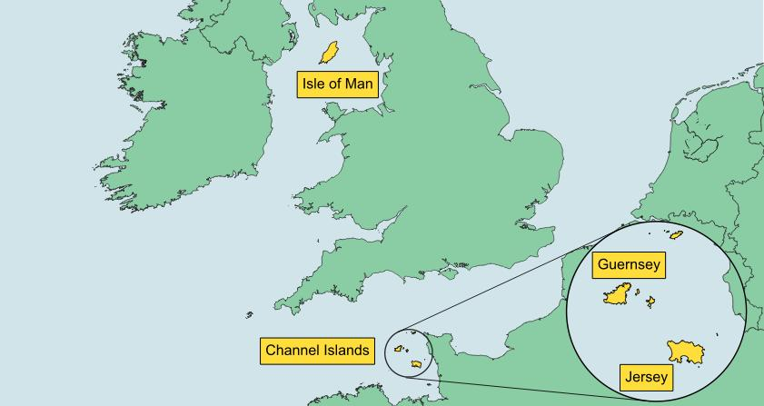

Wrote up some work I did for BRC, setting up a system for basic geocoding of postcodes in the Channel Islands and Isle of Man. 

Write-up [here](https://medium.com/digital-and-innovation-at-british-red-cross/creating-a-tool-to-understand-channel-islands-postcode-data-996b5cd6e72b) and GitHub links for the [Isle of Man](
https://github.com/britishredcrosssociety/isle-of-man-geocoding) and [Channel Islands](
https://github.com/britishredcrosssociety/channel-islands-geocoding) repos. 

The important part is the CSVs that contain the regex expressions to match partial postcodes to lat/long coordinates. I was a bit lazy and didn't fully turn it into a standalone programme but if it gains any traction I'll come back and improve it.
