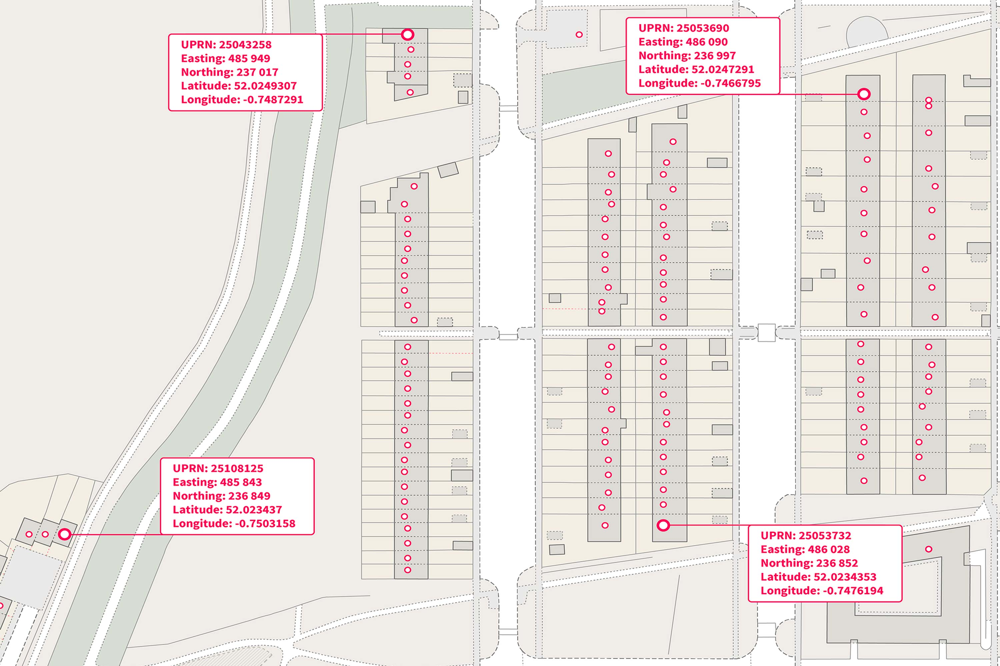
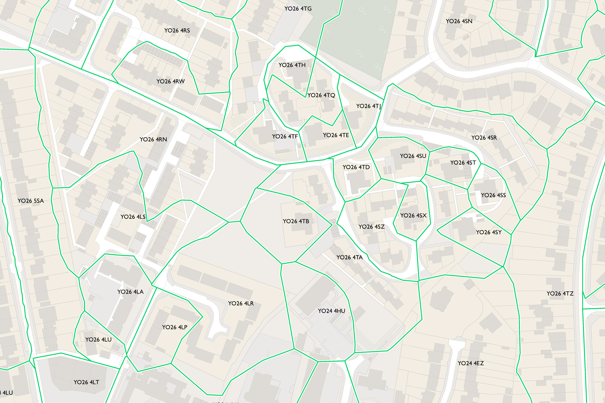
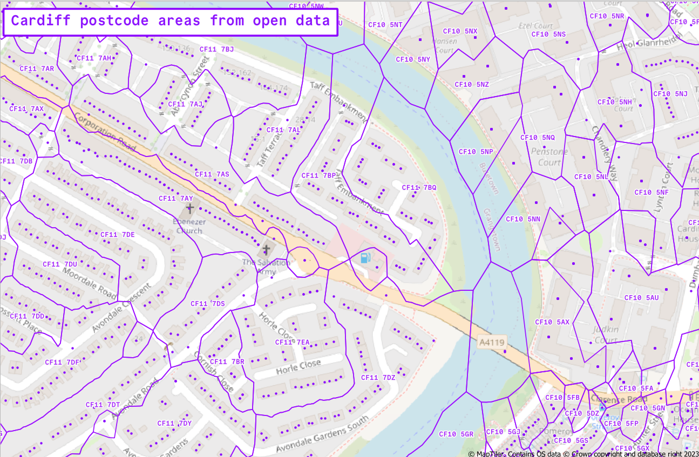

## Open UK Postcode data
In recent years a lot more UK postcode data has been made free to access. Ordnance Survey gives free access to postcode centroids ([Code Point Open](https://www.ordnancesurvey.co.uk/products/code-point-open#technical)) and the postcode of every address in the  UK ([Open UPRN](https://www.ordnancesurvey.co.uk/products/os-open-uprn#technical) - Unique Property Reference Number). 


*Open UPRN. Source: Ordnance Survey*

Postcode area boundaries - the area covered by each full postcode - are still paywalled though, under [Code-Point with Polygons](https://www.ordnancesurvey.co.uk/products/code-point-polygons). 


*Code-Point with Polygons. Source: Ordnance Survey*

## Alternative ways to make postcode area boundaries 
I found a post from [Mark Longair](https://longair.net/blog/2021/08/23/open-data-gb-postcode-unit-boundaries/) that outlines a way to make an approximation of the Ordnancy Survey boundary dataset using only open license postcode data. 

His method is: 
1. Load UPRN data
2. Create voronoi polygons from the addresses
3. Merge/dissolve the voronoi polygons using the postcode field 

I tried testing this workflow in QGIS but it quickly crashed, so I tried making the dataset smaller by just using addresses in Wales, and then just in Cardiff - but QGIS would still hang. 

After leaving it on hold for a few weeks, I came back to it this week to try to get something working in Python. 

## Python workflow for generating postcode area polygons 
### Load UPRN data
Loading the UPRN data is straightforward with GeoPandas. Before doing any more processing, I filtered the data down to just CF postcodes for quicker testing. The file I used for this proof of concept (`nsul_small_cf.csv`) is the UPRN data set from the ONS filtered to just CF postcodes and with all columns except the postcode and coordinates dropped. (NSUL = National Statistics UPRN Lookup.)

```{python}
import geopandas as gpd
import scipy
import shapely

gdf = gpd.read_file('./data/nsul_small_cf.csv')

gdf = gdf.set_geometry(gpd.points_from_xy(gdf.GRIDGB1E, gdf.GRIDGB1N)).set_crs(epsg=27700)
```
Voronoi polygons aren't implemented in GeoPandas but after some saerching I came across two options: 
[`scipy.spatial.Voronoi`](https://docs.scipy.org/doc/scipy/reference/generated/scipy.spatial.Voronoi.html) and [`shapely.voronoi_polygons`](https://shapely.readthedocs.io/en/stable/reference/shapely.voronoi_polygons.html). I tested both of these workflows with the Cardiff subset of addresses and both produced the same result in a couple of minutes. I find the shapely one slightly more concise, but have shared the code I used for both below. 

### Voronoi polygons with `scipy.spatial.Voronoi`
I copied and pasted this from [Michael Mann](http://michaelmann.i234.me/Welcome.html)'s [spatial interpolation page](https://pygis.io/docs/e_interpolation.html#thiessen-polygons-voronoi-diagrams) and it worked fine. 
```{python}
# Create voronoi polygons 
voronoi_polys = scipy.spatial.Voronoi(list(zip(gdf.geometry.x, gdf.geometry.y)))

# Create empty list to hold Voronoi polygons
voronoi_polys_list = []

# Create a polygon for each region
# 'regions' attribute provides a list of indices of the vertices (in the 'vertices' attribute) that make up the region
# Source: https://docs.scipy.org/doc/scipy/reference/generated/scipy.spatial.Voronoi.html
for region in voronoi_polys.regions:

    # Ignore region if -1 is in the list (based on documentation)
    if -1 in region:
        # Return to top of loop
        continue
    # Otherwise, pass
    else:
        pass
    # Check that region list has values in it
    if len(region) != 0:
        # Create a polygon by using the region list to call the correct elements in the 'vertices' attribute
        tp_poly_region = shapely.Polygon(list(voronoi_polys.vertices[region]))
        # Append polygon to list
        voronoi_polys_list.append(tp_poly_region)
    # If no values, return to top of loop
    else:
        continue

# Create GeoDataFrame from list of polygon regions
tp_polys = gpd.GeoDataFrame(voronoi_polys_list, columns = ['geometry'], crs = 27700)
```

### Voronoi polygons with `shapely.voronoi_polygons`
I found the documentation a bit lacking for this, but got it working through some trial and error. 
```{python}
# Shapely.voronoi_polygons takes a MultiPoint geometry as input - create one from the gdf
mp = shapely.MultiPoint(gdf.geometry)

# Run the voronoi_polygons tool
shapely_voronoi_polygons = shapely.voronoi_polygons(mp)

# voronoi_polygons returns a Shapely Polygon data type - convert this back to a geodataframe 
# https://gis.stackexchange.com/questions/395315/shapely-coordinate-sequence-to-geodataframe
gdf_shapely_voronois = gpd.GeoDataFrame(index=[0], geometry=[shapely_voronoi_polygons])

# Above step returns a single-value dataframe containing a GeometryCollection - to get this into a normal dataframe format I exploded the geometry and then reset the index. This returns a GeoDataFrame with one polygon per row. 
# Explode the geometry column
gdf_shapely_voronois = gdf_shapely_voronois.geometry.explode()

# Reset the index
gdf_shapely_voronois = gpd.GeoDataFrame(gdf_shapely_voronois).reset_index().drop(columns=['level_0', 'level_1'])

# Set the CRS to British National Grid (to match input data)
gdf_shapely_voronois = gdf_shapely_voronois.set_crs(epsg=27700)
```

### Add postcode values to voronoi polygons 
The voronoi polygons that are created don't take the attributes of the points they came from, which means they don't inherit the postcode of the point they're generated from. I added the attributes back with a spatial join. (I'll continue using the data from the Shapely workflow but from here the steps are identical for both options)

```{python}
gdf_voronoi_sjoin = gpd.sjoin(gdf_shapely_voronois, gdf)
```

### Dissolve voronoi polygons on postcode field 
There is now a polygon for each address, which is more detail than we need for the postcode area boundaries - I used geopandas' dissolve method to merge the address polygons on the postcode field, which returns a polygon that covers all the addresses that have the same postcode. 

```{python}
gdf_postcode_areas_dissolved = gdf_voronoi_sjoin.dissolve(by='PCDS')

# Dissolve transfers the attributes of the first feature by default - tidy up by removing columns that aren't needed 
gdf_postcode_areas_dissolved = gdf_postcode_areas_dissolved.drop(columns=['index_right', 'UPRN', 'GRIDGB1E', 'GRIDGB1N'])
```
### Export to GPKG
Finally, export the results to Geopackage so they can be loaded in QGIS. 

```{python}
gdf_postcode_areas_dissolved.to_file("./cf_voronoi_shapely.gpkg", layer='cf_voronoi_shapely_dissolved', overwrite=True)
```

### Results 
Here's what this looks like loaded into QGIS and added on top of OpenStreetMap. 


*Postcode area polygons for part of Cardiff*

The output needs a bit of extra work to be useful - e.g. clipping the polygons to a boundary layer. And Mark's original post lists various caveats to do with what actually goes into the UPRN dataset. However, this is still a good result for getting something useable from free data sources. 

I've not gone any further than processing the CF postcodes so far - trying the whole country would still crash my laptop. At some point I'll polish off the rough edges from this workflow and extend it to the whole UK on a more powerful machine. 

# Links
* [Ordnance Survey: Open UPRN data](https://www.ordnancesurvey.co.uk/products/os-open-uprn#technical)
* [Mark Longair: Open Data GB postcode unit boundaries](https://longair.net/blog/2021/08/23/open-data-gb-postcode-unit-boundaries/)
* [scipy.spatial.Voronoi](https://docs.scipy.org/doc/scipy/reference/generated/scipy.spatial.Voronoi.html)
* [shapely.voronoi_polygons](https://shapely.readthedocs.io/en/stable/reference/shapely.voronoi_polygons.html)
* [PyGIS: Thiessen Polygons (Voronoi Diagrams)](https://pygis.io/docs/e_interpolation.html#thiessen-polygons-voronoi-diagrams)
