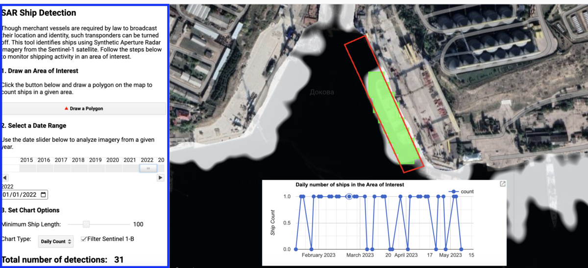
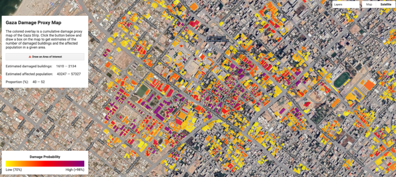

Recently listened to an old episode of the Bellingcat [Stage Talks podcast](https://rss.com/podcasts/bellingcatstagetalk/1058963/) from summer 2023 with Ollie Ballinger talking about using synthetic aperture radar imagery to track 'ghost ships' and detect building damage. 

There's [a write-up](https://www.bellingcat.com/resources/2023/05/11/peering-beyond-the-clouds-a-guide-to-bellingcats-ship-detection-tool/) on the Bellingcat website that covers the same material and demos a tool Ollie made to make the analysis more accessible - [a separate article](https://www.bellingcat.com/news/2023/08/21/russias-ghost-ships-and-the-evolution-of-a-grain-smuggling-operation/) goes into the findings of the research. 

The [ship detection tool](https://ollielballinger.users.earthengine.app/view/ship-detection-tool#lon=33.5519;lat=44.6249;zoom=17;) is available as a Google Earth Engine app.

In the podcast Ollie also talks about using SAR to detect building damage in Gaza - [writeup here](https://www.bellingcat.com/resources/2023/11/15/a-new-tool-allows-researchers-to-track-damage-in-gaza/). This tool is also released as [a GEE app](https://ee-ollielballinger.projects.earthengine.app/view/gazadamage), and Ollie has used the same method to look at building damage in Ukraine and Turkey/Syria [here](https://oballinger.github.io/PWTT/). 

There's definitely scope for SAR to be used more widely in the humanitarian sector and since Ollie and Bellingcat seem to be using SAR in a lot of their investigations, interested to see how it keeps developing.
