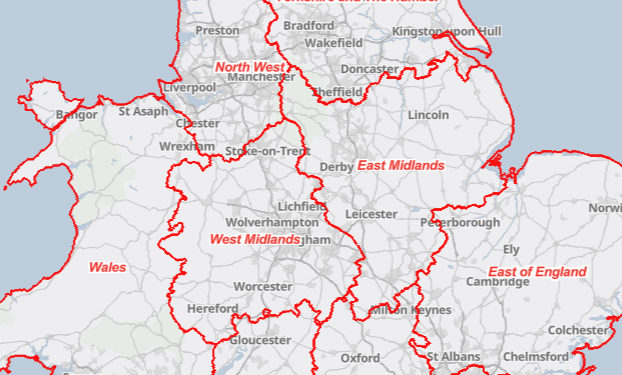
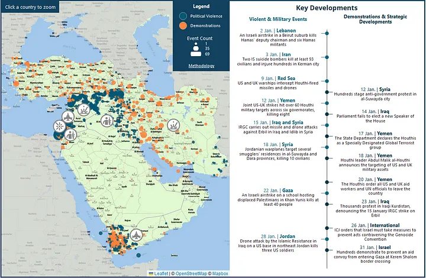

--- 
title: "2024 ▸ 07 ▸ Weeknote"
date: 2024-02-16
excerpt: 
 
editedDate:
tags: posts
draft: false
---

This week I’ve been splitting my time between finishing off a webmap request, making progress on some data processing tasks and revisiting an older data processing project to udpate it. I also joined the second workshop of Third Sector Lab’s Open Working programme, which had lots of good advice for writing online.

## Refugee Services webmap

Back in December 2023, our Refugee Services team requested an interactive map they can use to identify contacts in different regions. We’ve been through a few rounds of feedback and edits and it’s now almost ready. I spent some time this week exploring whether some nice-to-haves are possible or not in the [Zone Lookup webapp template](https://www.esri.com/arcgis-blog/products/arcgis-online/mapping/introducing-zone-lookup/) we’re using and testing out different options for displaying data in pop-ups.

The data is based on a table join between a spreadsheet with contact information and a boundary layer with the outlines of the different operating regions. Frustratingly, ArcGIS Online doesn’t have an option to refresh the join if the source data is updated. Existing data can be edited, which should meet 90% of the team’s needs, but when new contacts are added I’ll need to re-run the join and swap out the existing layer.

## Debugging ArcGIS Online content groups

I spent Thursday morning trying to figure out why I couldn’t add people to the content group to make updates to the contacts dataset, and after checking every setting I could think of asked a colleague for help. He suggested changing the [user types](https://doc.arcgis.com/en/arcgis-online/administer/roles.htm) from Data Editor to Publisher, which worked and fixed the problem. The difference between the user types isn’t well documented on the ESRI site, so we’re not sure if this behaviour is intetional or a bug.

## Working with the ACLED API

I finished writing a script to create an internal copy of [ACLED’s](https://acleddata.com/) conflict dataset for the countries we’re most interested in. I thought it would be quick but the API turned out to be slightly more complex than I had thought and I’ve been chipping away at it over two weeks. Some records get changed after publication and others get deletion notices issued on a separate API endpoint, so I had to take these into account to make sure our dataset stays accurate over time.

I also hit some limits with updating large numbers of records using the ArcGIS Online Python API — I solved it by adding a loop that uploads new data in batches of 2,500 records so that it doesn’t hit the API limit and cause an error.

## Updating Python processing script
A server I’ve been pulling data from has been moved to a new location, so I revisited the first Python script I wrote to feed a layer on ArcGIS Online. Since I wrote it, I’ve discovered better ways of doing some of the processing, so I rewrote it and cut the length by about half. The main changes were:

  * Using the [`logging`](https://docs.python.org/3/library/logging.html#module-logging) package to handle logging instead of a combination of `print` and updating a text file
  * Moving the geodata processing from [`arcpy`](https://pro.arcgis.com/en/pro-app/latest/arcpy/get-started/what-is-arcpy-.htm) to [`geopandas`](https://geopandas.org/). I started out using arcpy because I’d scoped out the workflow in ArcGIS Pro and then directly translated the steps into code. Performing the same actions in Geopandas is much more succinct, and Geopandas also does the same processing slightly quicker.

(I agree with [Matthew Haffner’s advice](https://geohaff.com/post/avoid-arcpy/) to avoid arcpy and use geopandas wherever you can.)

## PyQGIS refresher

On and off through the week I’ve been spending time refamilisarising myself with [QGIS’ Python interface](https://qgis.org/pyqgis/master/) and how it works. I did a week on this back in 2018 as part of my GIS MSc but my knowledge is rusty. It’s been helpful to get my head around how the classes work in QGIS and how to use the [various](https://docs.qgis.org/3.28/en/docs/pyqgis_developer_cookbook/) [documentation](https://qgis.org/pyqgis/3.28/) sites to understand what’s possible. Eventually I’d like to explore building a plugin to help with tricky tasks like setting up layouts and aligning mismatched boundaries (more on this in the future).
