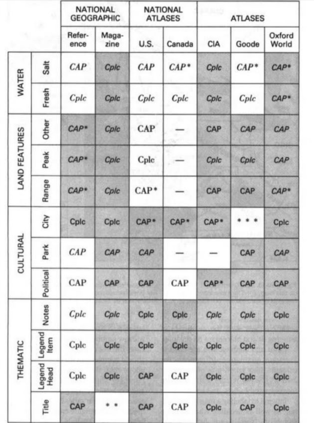

While doing some research on tyopgraphy in mapping, I found this table of cartographic lettering conventions on [Jill Saligoe-Simmel's website](https://www.drjill.net): 

_Source: [Using Text on Maps: Typography in Cartography](https://www.drjill.net/map-fonts-article-1-the-basics-of-typography-for-cartography/)_

I'd love to read the context that goes with the table; it's taken from the Guild Handbook of Scientific Illustration, which is available on Archive.org but restricted to the US.
