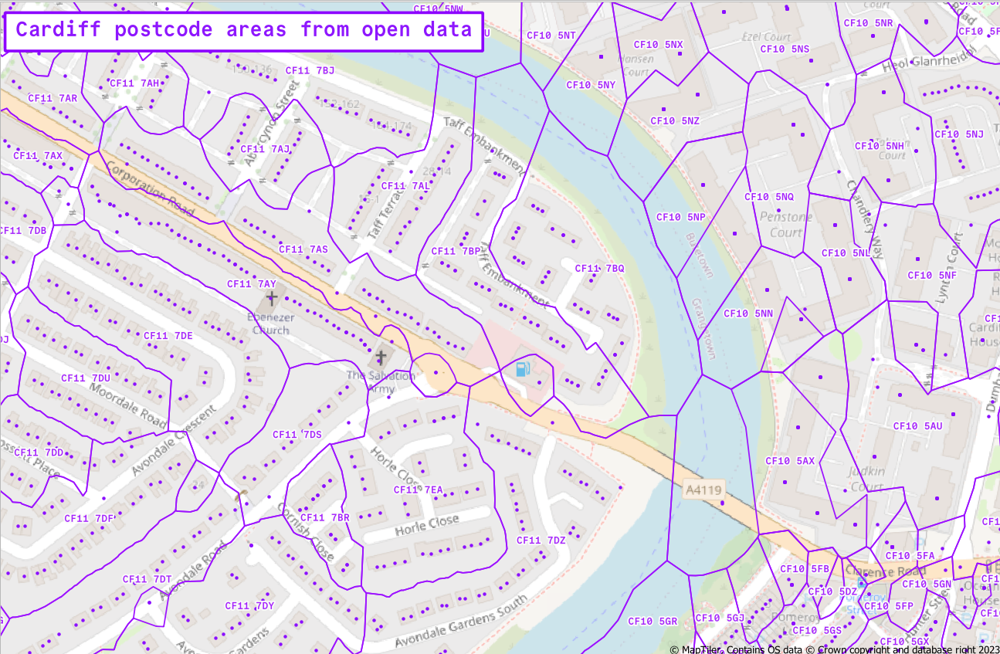

Fairly quiet week this week.

## Postcode area boundaries from open data

*Postcode areas generated from open data*

I did some testing on a way to create postcode area boundaries from open data. A lot of postcode data has been opened up in recent years, but the area covered by a postcode is still a paid product — only the locations of the central points are open data.

I came across a site which had details on how to approximate the paid dataset using open data and used some downtime this week to give it a try. Processing all the postcodes in the UK crashed my laptop so I tried again with just Cardiff (CF) postcodes, and got promising results — full write-up to come another time. Now that I know this is possible, it’s going back on the backburner until we have a more concrete use case for it.

## Postcode data errors report

Prompted by a colleague who’d seen a presentation about errors in postcode data, I went back to one of our data processing tasks to get a breakdown of the different reasons we can’t match some records to a valid postcode.

Running some checks against the data, 2% of records had invalid postcodes, which was much lower than I was expecting (and is unlikely to affect [the end product](https://medium.com/digital-and-innovation-at-british-red-cross/automating-geodata-processing-and-sharing-at-brc-eadb4af8c569), which is a heatmap of where our Independent Living service has been working in the last 12 months). Most of these just had no data (i.e. the postcode field was blank), and the next biggest group had comments saying things like “No address”, “Unknown”, “No fixed abode” or “N/A”.

Some postcodes were too long or too short, and others were the right length but had typos. A small number had extra spaces that if stripped out might match to a valid postcode — this was a useful discovery for improving the data processing. The script already removes any extra spaces at the start and end of the postcode value, but now I’ll remove all internal spaces too to bump up the match rate slightly.

## Usability improvements to datasets

Some of our experimental weather alert datasets are moving into production in a PowerBI dashboard another team is working on, so I spent some time this week making updates to smooth off some rough edges. This included things like updating field lengths so that more description text can be displayed (which is [a bit fiddly](https://support.esri.com/en-us/knowledge-base/how-to-increase-the-character-length-of-a-text-field-in-000030606) in ArcGIS Online) and changing timestamp formats from [Unix time](https://en.wikipedia.org/wiki/Unix_time) to human-readable date and time.

## Ad hoc support to colleagues

I provided some ad hoc support to colleagues who got in touch with queries about running attribute joins in ArcGIS Online and fixing an error in an R script that generates a monthly report. My R is a little rusty but I tracked the error down to a change in how the dates are formatted in the source CSV file and shared a fix for reformatting the dates.
