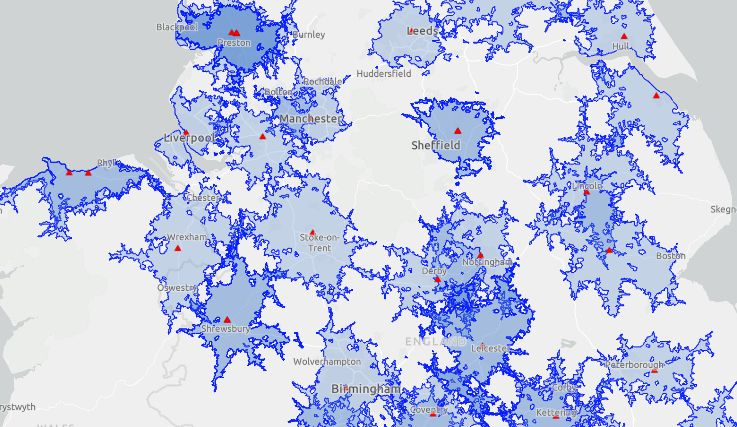
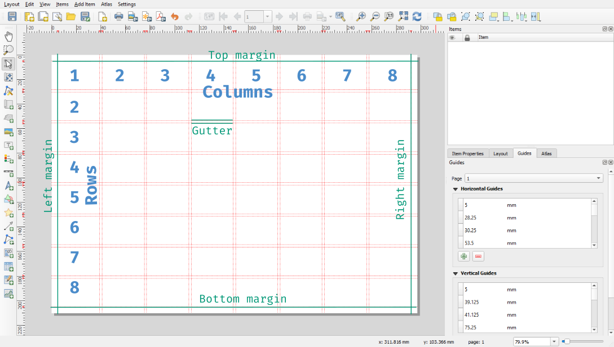

Squeezing in last week’s weeknote before it’s time to write this week’s.

# Live 30-minute drive-time coverage

_Screenshot of demo showing live 30-minute travel coverage from BRC response vehicles_

Last week I worked on a script that produces live coverage areas based on our response vehicles’ current locations. It shows the areas that are reachable within 30 minutes by any of our response vehicles and updates once an hour. I used the [TravelTime API](https://traveltime.com/) for this rather than the ESRI [service area analysis tool](https://pro.arcgis.com/en/pro-app/latest/help/analysis/networks/service-area-analysis-layer.htm). The ESRI service uses credits with an equivalent cost of about £120 per day to generate hourly service areas for 100 vehicles. For the TravelTime service, our usage fits comfortably on the free tier they’ve assigned us as a charity user (the API limit is 300 calls per minute). The demo of this dataset has already sparked some interesting conversations and I think it’s something we’ll develop more.

# Fixing errors in conflict data processing

A colleague spotted an issue with a data pipeline I set up to pull conflict data from the ACLED API for countries BRC works with. I’d seeded the dataset with six countries that are a priority for one team and then expanded it to cover 20 more countries that are useful for another team. In doing this, I forgot to regenerate the seed dataset, so the newer additions were missing historic data. I regenerated the seed data and am uploading around 1m new rows of data in chunks so that it doesn’t overwhelm the server.

# Building a QGIS plugin

On Tuesday, I took a personal development day to focus on developing my understanding of Python integration in QGIS through the [PyQGIS](https://qgis.org/pyqgis/) interface, which makes QGIS’ C++ functions available in Python.

It set myself a goal of building a working QGIS plugin, which I managed. It’s a tool to help standardise map layouts by providing a grid items can be aligned to following the [modular grid system](https://mark-anthony.ca/modular-grids-indesign/) (inspired by [this tool](https://tarasdesign.github.io/gridder/)). By default, QGIS’s layout guides are tricky to work with: you have to do lots of calculations based on the page size and enter them one by one in the guide settings.

_Screenshot of QGIS modular grid builder plugin_

This plugin is a step to making that easier — you can tell it what sort of grid you want and your page size, and it will add the guides automatically. It’s [now on GitHub](https://github.com/ioalexei/modular_grid_builder/) and hopefully it will be useful to at least someone else!
