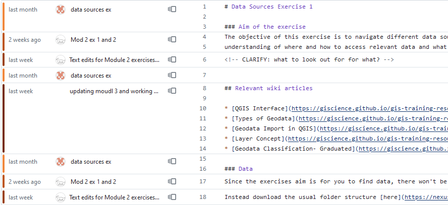
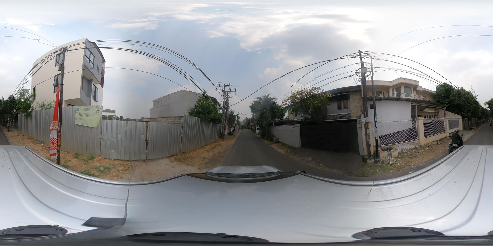

# Reviewing GIS training content

_[Git Blame](https://docs.github.com/en/repositories/working-with-files/using-files/viewing-a-file) view for a set of changes to the training material. [Source](https://github.com/GIScience/gis-training-resource-center/blame/main/content/Modul_2/en_qgis_data_sources_ex1.md)._

Last week I went back in time a bit. Early in my career I did editing work for a while, and this week I spent a lot of time reviewing and editing GIS training materials BRC is co-developing with other Red Cross national societies and [HeiGIT](https://heigit.org/). I got through the first half of the content, which is what we’ll be using in an upcoming training to test the content and the platform that makes the materials available to teachers and learners.

Developing training materials is hard, especially when it’s an open platform that can be used by anyone. When trying to think about useful feedback to give, I’ve found a couple of websites useful: [Nielson Norman Group](https://www.nngroup.com/articles/) and Greg Wilson’s [Third Bit](https://third-bit.com/).

NN Group have an archive of research and best practice on [writing on the web](https://www.nngroup.com/topic/writing-web/) as well as general usability advice. Greg Wilson set up the [Software Carpentries](https://carpentries.org/) training platform and shares useful insights on his personal site from a career in teaching software development.

# Discussions on how to prepare internal data for mapping

I had some useful discussions with people on other teams about how to expand the number of internal datasets we make available as geodata on ArcGIS Online. Having put together a proof of concept last year with data from one department, I’m now talking with people about what other departments (and datasets) we can use the same approach with. We’ve decided to test adding (suitably desensitised) volunteer locations and crisis response activity data. It’s early days so far but satisfying to see that the approach is useful and getting some traction.

# Street View Green View

_Sample image used in the Green View analysis. Source: Mapillary._

I took a look at a project American Red Cross are developing to automate creation of a [green index based on streetview images](https://github.com/AmericanRedCross/street-view-green-view) to judge how vulnerable an area is to wildfires. I had a go at contributing to one of the [open issues](https://github.com/AmericanRedCross/street-view-green-view/issues/8) and got some promising results. While we are less at risk of wildfires in the UK, particularly in urban areas, this approach could be helpful for informing areas at [risk from heat](https://www.redcross.org.uk/get-help/prepare-for-emergencies/heatwaves-uk), one of [BRC’s priorities](https://www.redcross.org.uk/about-us/what-we-do/we-speak-up-for-change/feeling-the-heat-a-british-red-cross-briefing-on-heatwaves-in-the-uk) in addressing the effects of climate change.

My code is typically only seen and used by me alone, so contributing to someone else’s project was a bit of a learning curve. I got my head around using [`typer`](https://github.com/tiangolo/typer) to make Python code easier to run from the terminal, [`ruff`](https://github.com/astral-sh/ruff) for code formatting, and [`venv`](https://docs.python.org/3/library/venv.html#module-venv) to keep track of the Python environment.

The actual scores generated by the Green View model seem a bit weird, so will have a look into why that might be — although it’s well beyond my area of expertise so not sure I’ll be able to help much on that part.
