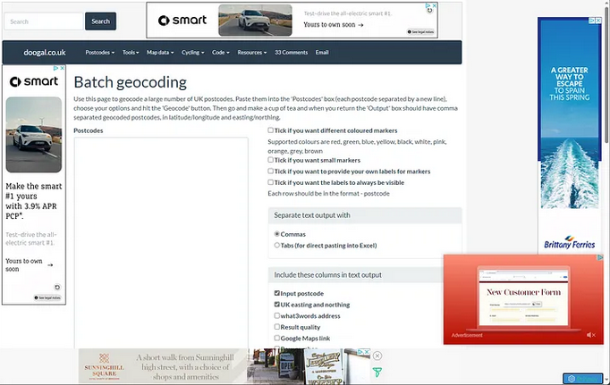
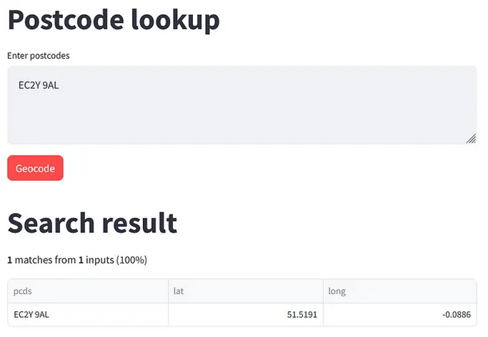
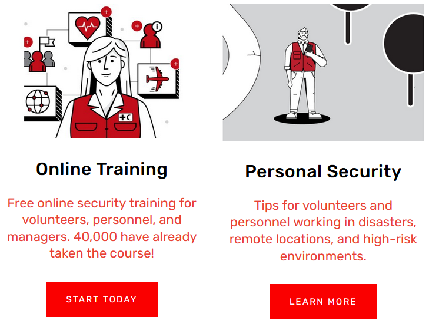

# Creating a geocoding tool

We had a call with a colleague this week who was interested in using [Excel’s ArcGIS plugin](https://medium.com/digital-and-innovation-at-british-red-cross/what-the-gis-im-team-enjoyed-working-on-in-2023-9cc0cc9f5413) to create some maps of addresses. When people are working with postcode data and need a quick way to batch geocode a list of postcodes and get back lat/long coordinates, we’ve usually recommended using the batch geocoding tool on Doogal.co.uk. On the call we did a demo and as I always use an adblocker, I was surprised to see how full of ads the page is without one.

_Screenshot of Doogal.co.uk Batch Geocoding tool_

This was a prompt to create our own version of the tool that could still provide the same processing but free from ads, cookie pop-ups and other bloat. I’d played around with making a postcode lookup tool with [Streamlit](https://streamlit.io/) in December, so I adapted that and added some code [I wrote last year](https://medium.com/digital-and-innovation-at-british-red-cross/creating-a-tool-to-understand-channel-islands-postcode-data-996b5cd6e72b) to geocode postcodes from the UK crown dependencies. The result is a simple postcode geocoding tool hosted for free on Streamlit.io: [UK postcode geocoder](https://postcodelookupapp-yaadvzhrseyhsdhbssw8qh.streamlit.app/).

<kbd></kbd>

_Screenshot of postcode geocoding tool_

The GitHub repo is [here](https://github.com/ioalexei/postcode_lookup_streamlit), any feedback welcome. Since postcodes are a bit of a pain for people trying to map data, I’ll likely use this as a starting point to build a few other tools that could be useful, like being able to find which of our operating regions a postcode is in.

# Safety & security training

I had to take some online security trainings as a precursor to a longer training I’m taking soon. For online trainings, they were surprisingly painless and didn’t take nearly as long as I thought they would.

_Screenshot of IFRC Stay Safe training site. [Source](https://ifrcstaysafe.org/)._

Aside from some Red Cross-specific content around the use of logos, it’s pretty widely applicable for anyone working in the humanitarian sector and I don’t think it’s restricted to RC staff. The trainings and materials are online at: https://ifrcstaysafe.org/.
