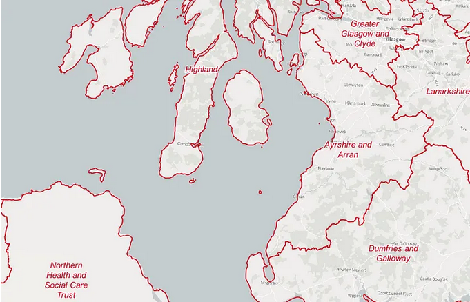
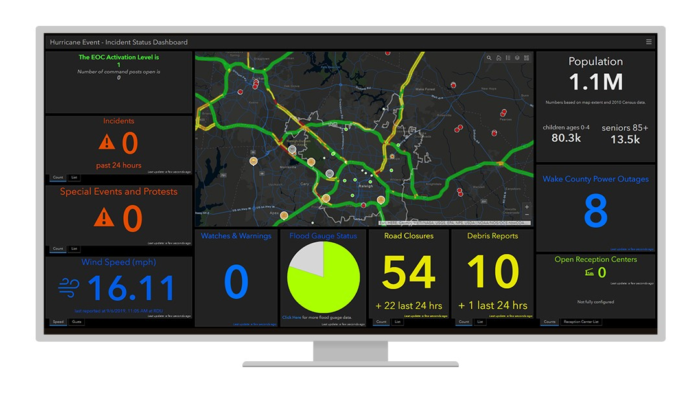
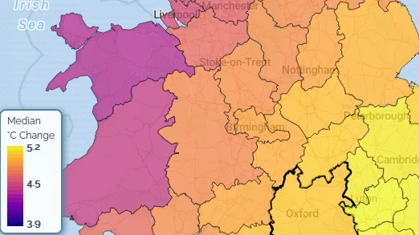

# Wrangling health board boundaries

This week we had a request from a colleague for a set of health board boundaries he could use in a PowerBI [Shape Map](https://www.microsoft.com/en-gb/industry/blog/cross-industry/2020/01/21/how-to-using-powerbi-shape-map-tool/). This ended up being slightly trickier than I expected — health board boundaries are published separately for each of the home nations, so step one was to round the all up from the official sources.

_Screnshot of UK health board boundaries_

Then, I merged them into a single file in QGIS and saved them to a GeoJSON. The first output came in at a 50MB which seemed like it would slow down PowerBI when loaded — so I ran QGIS’ new [area-based simplification](https://docs.qgis.org/3.34/en/docs/user_manual/processing_algs/qgis/vectorgeometry.html#simplify) algorithm to get a 1.2MB file.

However, the Shape Map tool takes [TopoJSON](https://github.com/topojson/topojson) format as an input, and QGIS doesn’t export to TopoJSON. Instead, I ran the file through [geojson.io](https://geojson.io/), which can export as TopoJSON. Despite taking more steps than I expected, the end result worked with Shape Map in PowerBI, and our colleague can now use the map to filter his data on their dashboard.

# ArcGIS Dashboards

Based on another request, I spend some time exploring [ArcGIS Online’s dashboarding capabilities](https://www.esri.com/en-us/arcgis/products/arcgis-dashboards/overview). It’s not as fully featured or as intuitive as PowerBI, but unlike PowerBI we have the ability to publish a AGOL dashboard outside the organisation. This means, for example, that we can make a dashboard and embed it on a public website, which at the moment we can’t do with PowerBI dashboards because of the way permissions are set up in Sharepoint/Office 365.

_Example of an ArcGIS dashboard from the ESRI website. [Source](https://www.esri.com/en-us/landing-page/product/2020/raleigh-nc-case-study)._

It took quite a lot of experimentation to get a dashboard that was useable and getting filters working takes a lot of clicking around various settings, but the demo dashboard was passable. In the end, the requestor decided they didn’t think a dashboard was right for what they want to show. Still, at least I’ll have a better idea of what’s possible with AGOL dashboards the next time they come up.

# Climate risk maps

_Screenshot of UK Climate Risk Indicators interface. [Source](https://uk-cri.org/)._

Another request that came in was for a series of maps based on data from the [UK Climate Risk Indicators](https://uk-cri.org/) website. I’ll continue working on this next week but for now I spent some time preparing the data — downloading the relevant data from the website and converting from GeoJSON to GeoPackage so that when I do come to use it it will be quicker to work with.
