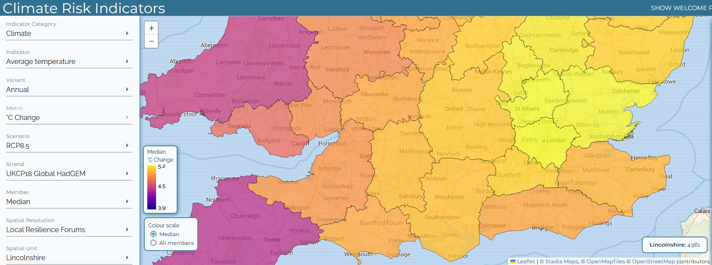

# UK Climate risk maps

Our team received a request to make some maps based on data from the [UK Climate Risk Indicators](https://uk-cri.org/) website, to be used in an upcoming report. It took me a long time to figure out how to download the right data — I didn’t find the website very intuitive — but once I had that sorted, I made a series of maps comparing various weather-related risks in different climate change scenarios.

_Screenshot of UK Climate Risk Indicators webmap tool_

I chose not to keep UKCRI’s magma palette, since a simple single-hue palette seemed to communicate the trends more effectively in this case. I also reduced the number of classes shown in each map to around five (a rule of thumb is that it’s hard to see differences if more than seven classes are used), and standardised the scales across each pair of maps to make them easily comparable. The UKCRI maps generate the classes/legend dynamically for each dataset, so comparing them using the tool is hard to do unless you’re paying close attention (the same colours refer to different values on each map).

# Mapping service users by postcode area

I worked on another request that came in to repeat some analysis I helped with in 2023 to summarise where one of our services has been working with people in Wales. The source data was a list of service users by postcode [outcode](https://ideal-postcodes.co.uk/guides/uk-postcode-format) (the first part of a UK postcode, before the space), which they wanted mapping to health board boundaries.

_Screenshot of Welsh health board boundaries; service user data not shown._

To prepare the data, I went through these steps:

* In Excel, create a pivot table to show the count of users in each outcode area, export to CSV
* Using Python and Pandas, load the latest [ONS Postcode Directory](https://geoportal.statistics.gov.uk/search?q=PRD_ONSPD+FEB_2024&sort=Date+Created%7Ccreated%7Cdesc) and add a new column for just the outcode and save as a new file
* Load the CSV into QGIS and run [_mean coordinates_](https://docs.qgis.org/3.34/en/docs/user_manual/processing_algs/qgis/vectoranalysis.html#mean-coordinate-s) grouped by outcode area — this gives the geographic centre of all the postcodes with the same outcode
* Join this layer to the pivot table and set the symbol size to reflect the number of users

As an extra step, I ran a spatial join between the user locations and the Welsh health board boundaries — this step wasn’t needed to visualise the data, but meant I could add a summary table to the final product showing the number (sum) of users in each health board area.

# GIS training

We ran a three-part introduction to QGIS training to test the IFRC GIS training platform that’s been in development since 2023. We had a group of 11 trainees from four countries with experience levels ranging from complete beginner to intermediate. The training was run over three half days and covered an introduction to GIS and QGIS, working with spatial data, creating map layouts and basic spatial data operations.

The training went well and trainees said they were happy with the course, but we still learnt a lot about how we could improve the training structure and materials. The most obvious finding was that we need to rethink how much material it’s possible to cover in three half days — it was a bit of a squeeze to fit in everything we wanted. We’ll have a debrief next week to figure out how to finalise the materials.
