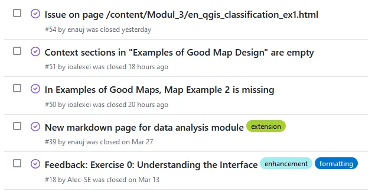
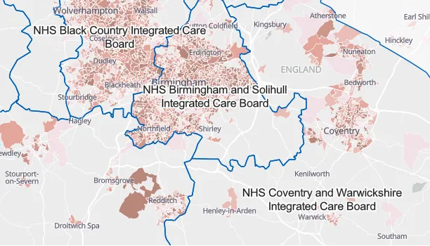

# GIS training debrief

Following the GIS training we ran last week, I had a debrief call with the other facilitators. We had good feedback from the trainees but also lots of input from us as facilitators on how to improve the training. We decided to take time to consolidate this feedback and implement a more robust project management structure to help us decide which changes to prioritise in the short term and which to leave for later.

_Screenshot of closed issues from the GIS training platform’s [GitHub repo](https://github.com/GIScience/gis-training-resource-center)_

We decided to use GitHub’s [project management features](https://docs.github.com/en/issues/planning-and-tracking-with-projects/learning-about-projects/about-projects) to keep track of this going ahead — it makes sense as we’re already publishing the material on GitHub. We had been managing issues and feedback in a series of Word and Excel docs on an external Sharepoint site, which was getting unwieldy.

I’ve been spending some time reading through the IFRC’s [Surge Learning Toolbox](https://surgelearning.ifrc.org/) that has lots of good advice on developing trainings; we’ve already met a lot of the good practice standards but there are also things we skipped to get an initial version available quickly. Now’s a good time to reflect on where there might be gaps we should go back and fill.

# Mapping deprivation across health boards

_Screenshot of deprivation index combined with health board boundaries. [Source](https://experience.arcgis.com/experience/dc4cb15c3c154caf991783bfb8022925/page/Information/)._

At our team’s drop-in session this week we had a discussion with a colleague about how best to show health board boundaries alongside deprivation data in a PowerBI dashboard. After talking through the various options in PowerBI and their pros and cons, we decided to implement the map in ArcGIS Online instead. Because no internal data is involved, it was easier for us to use AGOL’s more flexible data integration options and make the map public than it would be to achieve something similar in PowerBI. A colleague combined the data and split it by region, to make it easier for teams to find the data that is most relevant to them. And because the map could be made public, users don’t need to have an ESRI license to access it.

# Community of Practice planning

I spent Friday doing some ‘gardening’ on the geospatial and Python communities of practice I’m involved with. This involved lining up speakers for the next couple of months, sending out updates and sharing changes to scheduled events. I also spent a bit of time preparing possible questions and topics for an upcoming session of the Python user group where we don’t have a speaker — I expect people will have plenty of questions and topics to bring to the call, but it helps to have some prepared as backup just in case.
