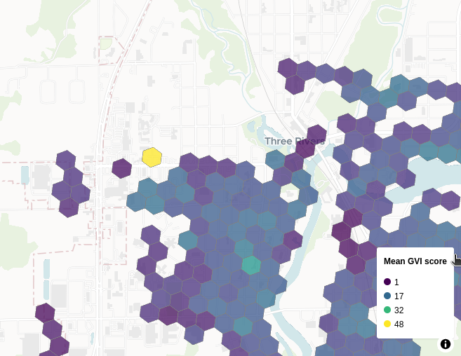
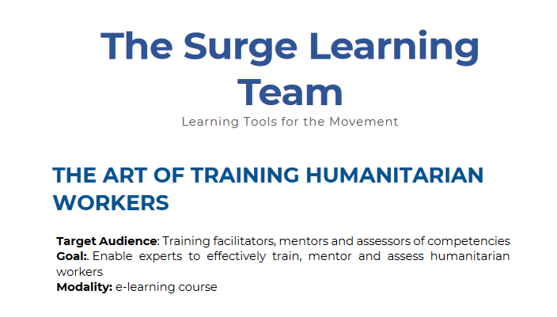

# Street View Green View

In March, I contributed to [Street View Green View](https://github.com/AmericanRedCross/street-view-green-view), an American Red Cross project that classifies an area by the amount of greenery visible in Street View imagery. This week, I worked on some code to process the green index scores generated by package so they can be displayed on a webmap.

_Screenshot of MapLibre webmap showing summary of Green Index scores._

I used a [h3 hex grid](https://h3geo.org/docs/) to summarise the data, and [MapLibre](https://maplibre.org/) for the interactive webmapping. While h3 has a Python package ([`h3`](https://pypi.org/project/h3/)), I used the [`h3-geopandas`](https://h3-pandas.readthedocs.io/en/latest/index.html) package, which makes it just that bit easier to pass data to and from geodataframes.

Webmapping relies a lot on JavaScript, and MapLibre is no different. While I know the basics, I’m not an expert, so I relied on Python to set up variables and then passed them into the HTML doc via the Jinja templating engine. This turned out to be a great shortcut — I got the same end effect but didn’t have to spend a lot of time learning new bits of JS.

# IFRC Art of Training course

As part of my effort to better understand best practices in facilitating training, I took IFRC’s [Art of Training](https://ifrc.csod.com/ui/lms-learning-details/app/curriculum/0c965aa5-4eec-434b-96f8-9eeb7df03534) online course. It has four 40 minute modules on facilitation, mentoring and assessment. The bits on mentoring were less relevant to me, but I found the sections on training design and facilitation really helpful.

_Screenshot of flyer for the IFRC’s Art of Training e-learning course. [Source](https://surgelearning.ifrc.org/sites/default/files/media/document/2022-05/Surge%20Learning%20Team%20-%20The%20Art%20of%20Training%20Humanitarian%20Workers_1.pdf)_.

# Data gardening

I spent some time ‘gardening’ some of the datasets we host for others in the organisation to use: adding new data where it’s available, fixing some minor errors, and deprioritising some data-related Jira tasks that have been on the backlog for a while (after talking to colleagues and finding out they’re no longer needed).
