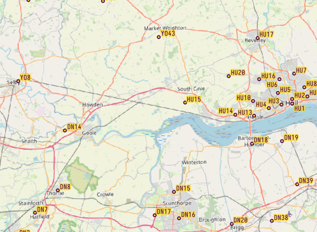

I’ve missed a few weeks of weeknotes, so bundling a few weeks together for a roundup of the top three things things I’ve worked on in May and June.

## Postcode area mean centres

Based on a few [recent requests](https://medium.com/open-working-reuse/2024-17-climate-risk-and-service-user-maps-gis-training-35a654f3f50e) around mapping postcode areas, I made a dataset that shows the geographic centre of each postcode area, that is all postcodes sharing the same outcode. The outcode is the part of a UK postcode that comes before the space — i.e. for W1A 1AA, the outcode would be W1A.

I made the dataset with Python by using the [ONS Postcode Directory](https://geoportal.statistics.gov.uk/datasets/521edce4159a451a932539b7fc786322/about), following these steps:

1. Open the postcode directory in pandas (to speed up processing I just used the postcode, lat and long columns)
2. Remove non-geographic postcodes (in the ONSPD these are given a coordinate location of `0.0, 99.9`)
3. Create a new column for the postcode area (select the postcode text before the space)
4. Using Pandas, group by the postcode area and aggregate the lat and long columns by taking the mean of the values

_Sample image of mean centres for UK postcode areas_

The ONSPD is released under the [Open Government License](https://www.nationalarchives.gov.uk/doc/open-government-licence/version/3/), which means we can make this adaptation available for other people to use as well — so it’s hosted on [ArcGIS Online.](https://britishredcross.maps.arcgis.com/home/item.html?id=c65598ef0b1a476189b11eb7a3e3c8b8#overview)

The next step will be to generate corresponding polygons (using the same method I outlined [here](https://medium.com/open-working-reuse/2024-09-weeknote-7dbafdb0a8ba)).

## Documenting deployments API

BRC uses an online platform to manage personnel for deployments from our surge teams and registers. To make it easier to use data from the platform in internal reporting, I’ve been documenting the API that sits behind the web interface (with the permission of the developers) and building a simple Python script that colleagues can use to refresh the data when they need to. Some other Red Cross organisations use the same software, and I’ve had helpful support from them to get started.

## Travel time from event venue analysis

I’ve started a new task to build a tool that can help our marketing team identify supporters close to events BRC is organising. The team would like to be able to message supporters living within a certain driving distance from an event venue. Building a tool that can base geographic targetting based on travel times rather than a simple distance buffer wil hopefully mean we can target communications to the people they are most relevant to. I’ll be prototyping this in the coming weeks and will write up a longer post when I’ve got a working product.
