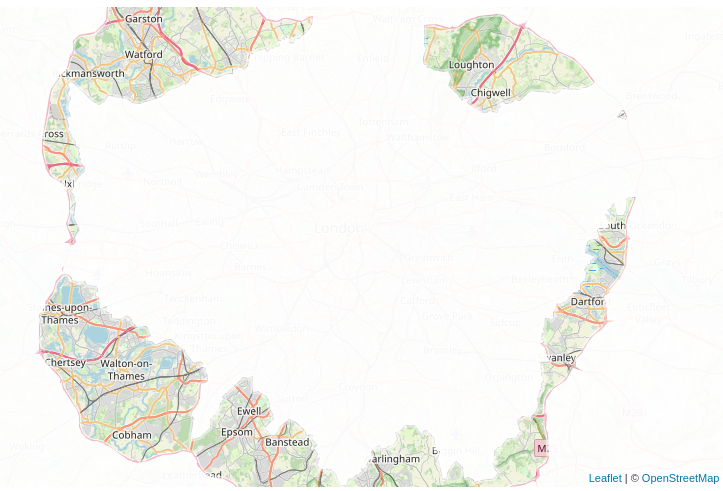

[Is it in London?](https://andrewl.github.io/30-day-map-challenge-2024/13-a-new-tool.html) 
A fun webmap Andrew Larcombe made for 30daymapchallenge 2024 - it shows places 
that are within the M25 but not in a London borough. Everything inside the GLA
and outside the M25 is masked out. 

It's made in R and published with Leaflet. 
