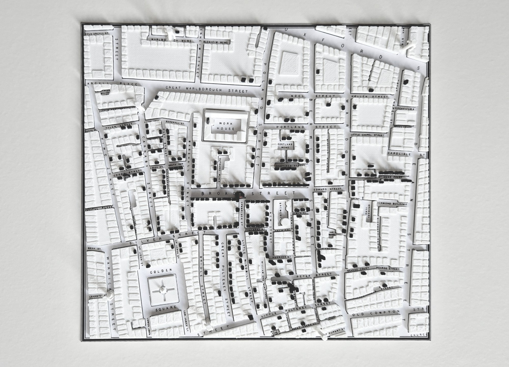
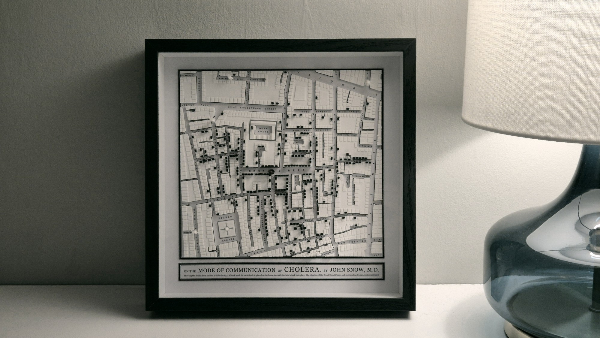

Another post on a link I saved browsing 30daymapchallenge submissions on the Datawrapper blog: [Alex Selby-Boothroyd](https://bsky.app/profile/alexselbyb.bsky.social)'s 3d-printed recreation of the famous John Snow cholera map. It looks way better than I'd have thought if you'd just described it to me.  

> @alexselbyb.bsky.social: [Day 18 #30DayMapChallenge. I 3D-printed John Snow's 1854 cholera map of Soho. It took ages.](https://bsky.app/profile/alexselbyb.bsky.social/post/3lba4wzj3i22i)

