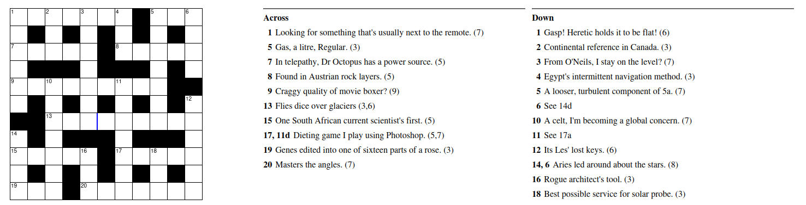

[Barry Rowlingson](https://mapstodon.space/@geospacedman@mastodon.social) shared a [geospatial-themed cryptic crossword](https://b-rowlingson.gitlab.io/geocrossword/) 
in the newsletter of the Lancaster Data Science Institute's Geospatial group.

I enjoyed completing it - the [Exet](https://github.com/viresh-ratnakar/exet) web app for building and sharing the crossword is neat too. 

Barry shared the answers in the [April/May DSI Geospatial newsletter](https://wp.lancs.ac.uk/geospatial/2025/05/09/dsi-geospatial-april-may/).