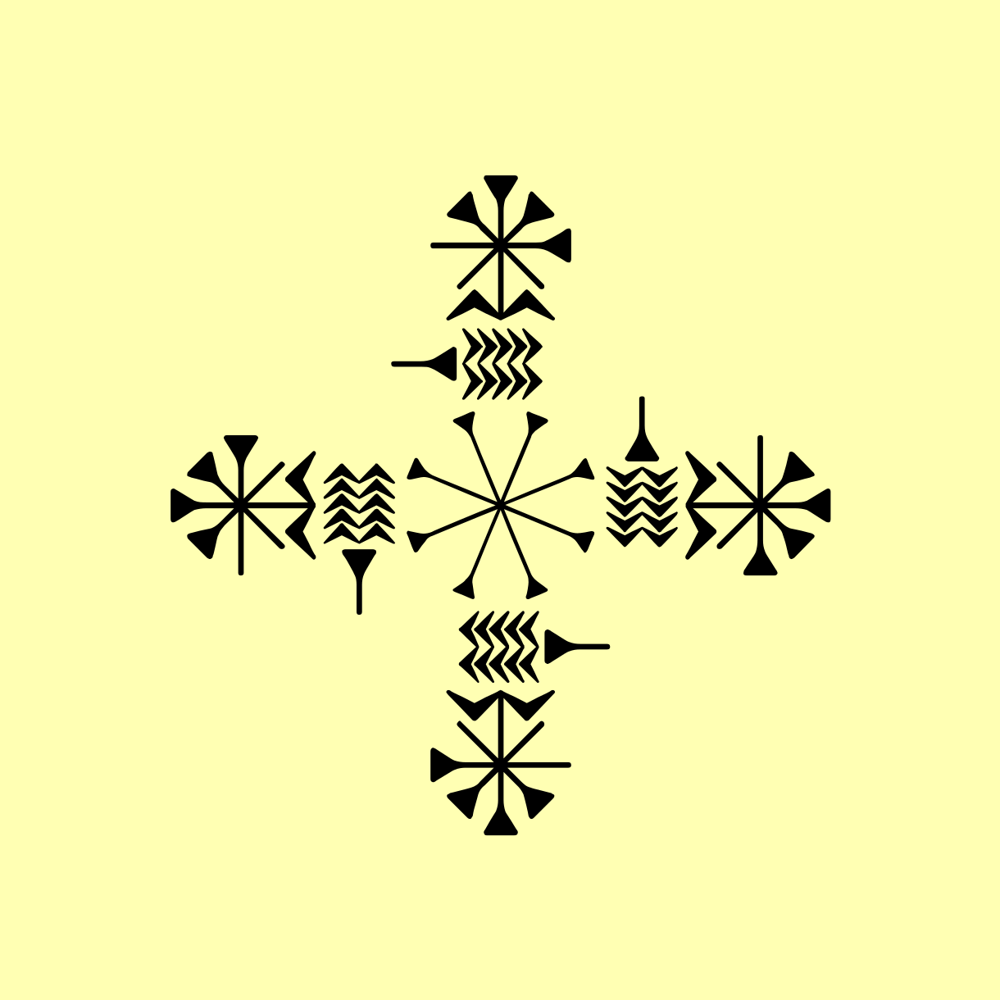

Went down a cuneiform rabbit hole and came across this beauty. No idea what it means.

Unicode: 

[𒀱](https://decodeunicode.org/en/u+12031)

Image: 

Lots more lovely cuneiform unicode examples on [the Wikipedia page](https://en.wikipedia.org/wiki/Cuneiform_(Unicode_block))
