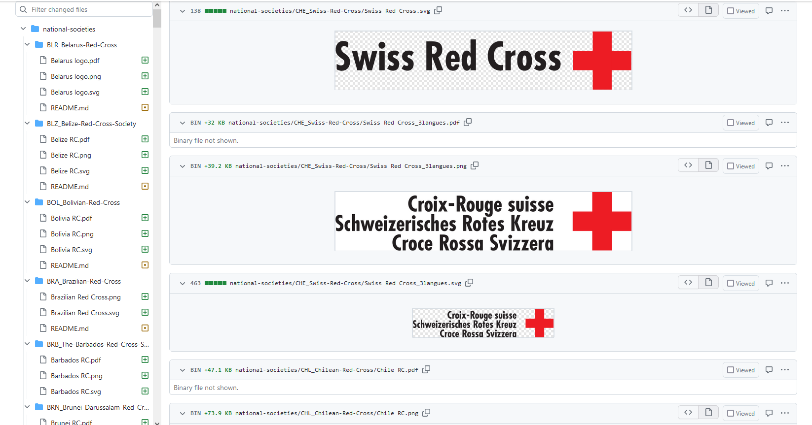

IFRC maintains [a GitHub repo](https://github.com/IFRCGo/logos) with the official 
logos for ever Red Cross National Society. A good chunk of them were in the EPS 
(Encapsulated PostScript) format, which is hard to use in non-Adobe software. 

Given that we often need to use national society logos on maps, it's helpful to 
have copies in PNG/JPEG or SVG. I toyed around with the idea of writing a Python 
script to process all the EPS files but it turned out they needed a human eye 
involved in the processing, since some of the EPS files were corrupt, had errors 
or were out of date. 

I took advantage of having access to Adobe Creative Cloud with Adobe Acrobat Pro 
to convert the EPS files - the standard free version of Acrobat doesn't allow 
you to convert EPS files. (And as I gave up my Creative Cloud subscription, I 
can't use this workflow any more.)

My basic workflow for converting the EPS files to more usable formats was: 

1. Open the EPS file in Adobe Acrobat Pro 
2. Adobe asks if you'd like to convert the file - confirm
3. Save the converted EPS file as a PDF
4. Open the PDF file in Inkscape
5. Save as SVG
6. Save as PNG (remember to set the background to white rather than transparent
if that's important for the image)

This ended up as my [first GitHub pull request](https://github.com/IFRCGo/logos/pull/14) 
(I had to ask someone to show me how to do it) - updating 447 files in the repo. 

*Screenshot of some of the updated logos*

Some issues I found in the repo along the way: 

* Not all national societies have a website, so it can be hard to tell which is 
the current/official logo when there were several options
* Some national societies appear to use different versions of their logos at 
the same time (e.g. an older version might still be used alongside a newer one).
* Some of the EPS files had corrupted text where there should be Arabic script. 
Luckily, most of these also had an uncorrupted version as well.
