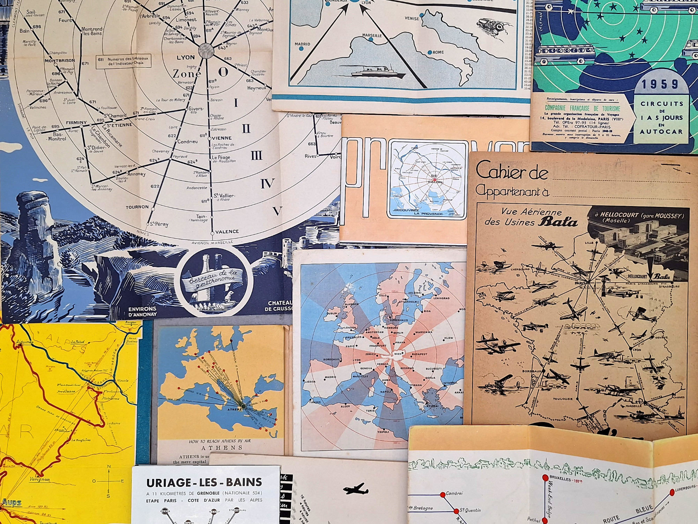

[Fotokino](https://fotokino.org) in Marseille has an exhibition about cartography and graphic design, [_Toute latitude — La cartographie, c’est du graphisme_](
https://fotokino.org/agenda/toute_latitude_poullard_monsaingeon/).

The exhibition aims to show 'cartography as the forgotten element of graphic design history'. 

It looks great! I've got no chance of seeing it before it ends this week but enjoyed the PDF catalogue and the images from the show on the website.
