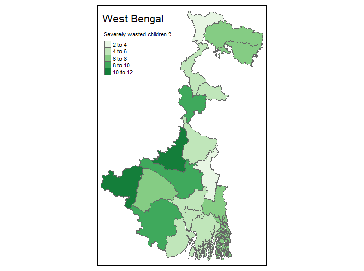
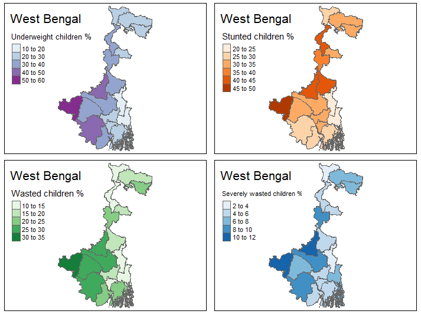

In the previous post, I discussed a method for extracting district-level child malnutrition data from Indian government PDFs. This post will look at mapping that data. 

## Data sources
As well as the extracted health survey data, I need a source of spatial data that has Indian district boundaries. My go to source for this would ordinarily be the Database of [Global Administrative Areas (GADM)](https://gadm.org/). While GADM does have district-level boundaries for India, the ID codes used as attributes are different to the census ID codes used in the file names for the survey data. The Natural Earth dataset has the same problem. Luckily, [Datameet](http://datameet.org) has created an open dataset that solves this problem - it provides district boundaries with a census code attribute that I can match to the file names: 

[Datameet / Maps / Districts / Census_2011](https://github.com/datameet/maps/tree/master/Districts/Census_2011)

Note that the census boundary data is for 2011 while the health survey data is from 2015--16, so it's possible there have been changes to boundaries in between. 

## Libraries 
First we'll load the libraries: `sf` to deal with spatial objects, `tidyverse` to subset data and `tmap` for mapping. I've tried out `plot` and `ggplot2` for mapping but find `tmap` to be more intuitive. [^1]

```r
library(sf)
library(tidyverse)
library(tmap) 
``` 

## Joining data 
First, I read in the district boundaries. Then I generate a list of the files to pull data from - note that here I've limited this to a single state, West Bengal, by only using that state's directory (`"data/WB"`). 
```r
sf <- st_read("geodata/Census_2011/2011_Dist.shp")

files <- list() 
files <- list.files("data/WB", pattern=".csv", recursive=TRUE, full.names=TRUE)
```
After creating an empty `data.frame` to hold the extracted data, I set a loop to: 
  * Extract the district census ID from the file name
  * Read the CSV file
  * Pull out the measurements for each variable
  * Add those columns to the data frame
  
The last two steps could be combined into one, but I find that keeping them separate makes the steps easier to follow.  

When the loop is finished, I rename the columns to match the variables.

```r
df <- data.frame()

for (f in files){
  df[f,1] <- as.numeric(str_split_fixed(f, "_", 4)[3])
  x <- read.csv(f)
  u5stunted <- x[1,length(colnames(x))] # accounts for some files having 3 columns, some 4
  u5wasted <- x[2,length(colnames(x))]
  u5sevwasted <- x[3,length(colnames(x))]
  u5underweight <- x[4,length(colnames(x))]

  df[f, 2] <- u5stunted
  df[f, 3] <- u5wasted
  df[f, 4] <- u5sevwasted
  df[f, 5] <- u5underweight
}

colnames(df) <- c("censuscode", "u5stunted", "u5wasted", "u5sevwasted", "u5underweight")
```

Now that we have extracted the data and census codes, we can join the data frame to the spatial data on the census code attribute. The joining column needs to be of the same format, which is why in the chunk above the census code is transformed with `as.numeric`. Using `right_join` gives us just the West Bengal districts rather than all Indian districts. 

```r
wb_maln <- right_join(sf, df)
```

## Mapping 
Then it's straightforward to map the data with `tmap`. 
```r
tm_shape(wb_stunt) + 
  tm_polygons(col = "u5sevwasted", title="Severely wasted children %", palette = "Greens") + 
  tm_layout(title = "West Bengal")
```


`tmap_arrange` also makes it fairly easy to plot multiple maps, so I can show the distribution of each of the vairables in a single image. [This page](https://www.datanovia.com/en/blog/top-r-color-palettes-to-know-for-great-data-visualization/) has a handy reference to the naming of colour schemes. 

```r
u5sw <- tm_shape(wb_stunt) + 
  tm_polygons(col = "u5sevwasted", title="Severely wasted children %", palette = "Blues") + 
  tm_layout(title = "West Bengal")

u5w <- tm_shape(wb_stunt) + 
  tm_polygons(col = "u5wasted", title="Wasted children %", palette = "Greens") + 
  tm_layout(title = "West Bengal")

u5s <- tm_shape(wb_stunt) + 
  tm_polygons(col = "u5stunted", title="Stunted children %", palette = "Oranges") + 
  tm_layout(title = "West Bengal")

u5u <- tm_shape(wb_stunt) + 
  tm_polygons(col = "u5underweight", title="Underweight children %", palette = "BuPu") + 
  tm_layout(title = "West Bengal")

tmap_arrange(u5u, u5s, u5w, u5sw)
```


## Full script
```r
library(sf)
library(tidyverse)
library(tmap) 

sf <- st_read("geodata/Census_2011/2011_Dist.shp")

files <- list() 
files <- list.files("data/WB", pattern=".csv", recursive=TRUE, full.names=TRUE)
df <- data.frame()

for (f in files){
  df[f,1] <- as.numeric(str_split_fixed(f, "_", 4)[3])
  x <- read.csv(f)
  u5stunted <- x[1,length(colnames(x))] # accounts for some files having 3 columns, some 4
  u5wasted <- x[2,length(colnames(x))]
  u5sevwasted <- x[3,length(colnames(x))]
  u5underweight <- x[4,length(colnames(x))]

  df[f, 2] <- u5stunted
  df[f, 3] <- u5wasted
  df[f, 4] <- u5sevwasted
  df[f, 5] <- u5underweight

}

colnames(df) <- c("censuscode", "u5stunted", "u5wasted", "u5sevwasted", "u5underweight")

wb_maln <- right_join(sf, df)

tm_shape(wb_stunt) + 
  tm_polygons(col = "u5sevwasted", palette = "Greens") + 
  tm_layout(title = "West Bengal")

u5sw <- tm_shape(wb_stunt) + 
  tm_polygons(col = "u5sevwasted", title="Severely wasted children %", palette = "Blues") + 
  tm_layout(title = "West Bengal")

u5w <- tm_shape(wb_stunt) + 
  tm_polygons(col = "u5wasted", title="Wasted children %", palette = "Greens") + 
  tm_layout(title = "West Bengal")

u5s <- tm_shape(wb_stunt) + 
  tm_polygons(col = "u5stunted", title="Stunted children %", palette = "Oranges") + 
  tm_layout(title = "West Bengal")

u5u <- tm_shape(wb_stunt) + 
  tm_polygons(col = "u5underweight", title="Underweight children %", palette = "BuPu") + 
  tm_layout(title = "West Bengal")

tmap_arrange(u5u, u5s, u5w, u5sw)
```
## Footnotes
[^1]: [tmap: Getting started](https://cran.r-project.org/web/packages/tmap/vignettes/tmap-getstarted.html#options-and-styles) // [Geocomputation with R: Making Maps with R](https://geocompr.robinlovelace.net/adv-map.html#static-maps)
