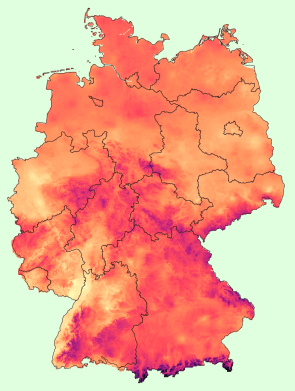

Enjoyed this post by Gregor, co-founder of [Datawrapper](https://www.datawrapper.de/), about space-time analysis:  
[Four pitfalls of spatiotemporal data analysis and how to avoid them](https://www.vis4.net/blog/2023/12/spatiotemporal-data-analysis-pitfalls/)

The pitfalls he talks about are: 

  1. Temporal skewing
  2. Incomplete time intervals
  3. Unevenly distributed spatial measurements
  4. Choosing the wrong interpolation method

It's well written, with helpful illustrations, going through a case study of analysing average temperatures in Germany over time.
