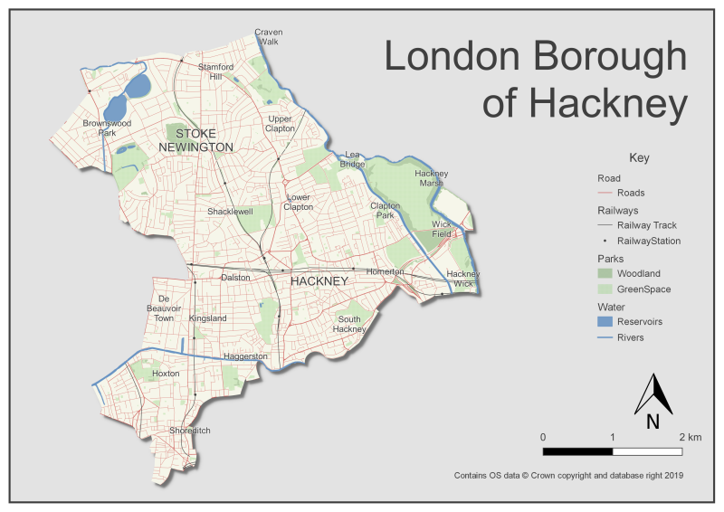
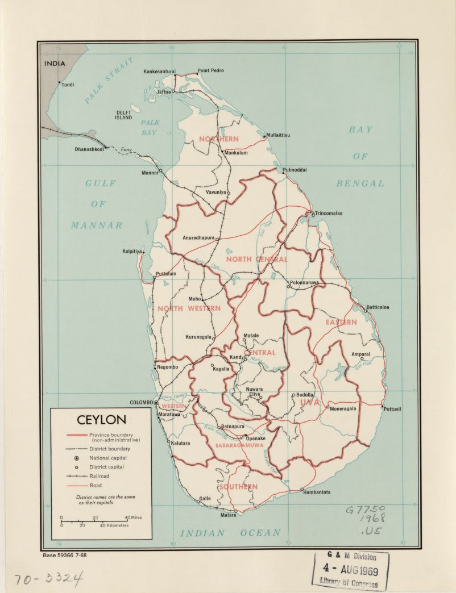

A map I made of Hackney in London, using QGIS and Ordnance Survey open data. 

The place names are pulled from the OS data too, although there are some odd choices - I'm not sure you'd include Craven Walk, Wick Field or Brownswood Park if you were using this map for anything - but for the purposes of playing around with QGIS it's fine to leave them in. 

The style is loosely based on a [1970 map of Ceylon](https://www.loc.gov/item/73691924/)  I came across on the Library of Congress' online map archive  (which is full of cartographic inspiration).

