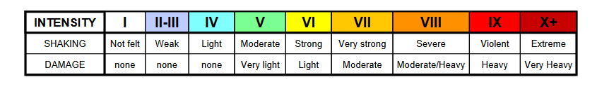

For a recent task I needed to show earthquake activity on a map. Since people have been making a lot of use of US Geological Survey maps and data, I wanted to use the same colour scheme they use to represent intensity: 

Adapting from [this](https://en.wikipedia.org/wiki/Modified_Mercalli_intensity_scale) Wikipedia article, I created a discrete colour ramp in QGIS which I'm sharing here in case it's useful to others. 

[Download QGIS earthquake intensity style](https://github.com/ioalexei/SIMS_QGIS_resources/blob/main/QGIS%20colour%20files/QGIS-colours-earthquake-intensity-mercalli-scale.xml)
