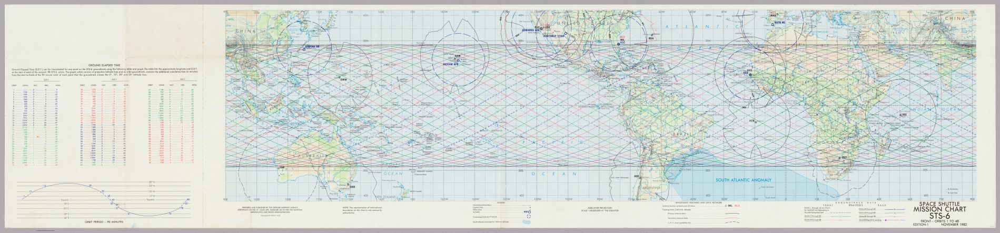
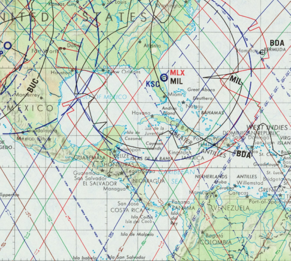
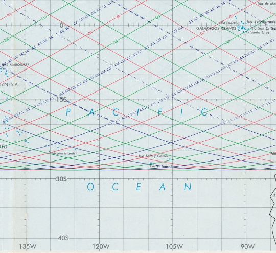

Two NASA maps of space shuttle orbits from 1982/3, from the David Rumsey collection: 

* [Space shuttle mission chart STS-9/SL-1. Front orbits 1-80](https://www.davidrumsey.com/ll/detailView.html?mid=RUMSEY~8~1~360398~90127559&manifestUrl=https%3A%2F%2Fwww.davidrumsey.com%2Fluna%2Fservlet%2Fiiif%2Fm%2FRUMSEY~8~1~360398~90127559%2Fmanifest&os=0&lc=RUMSEY~8~1&q=pub_list_no=13142.000&baseUrl=%2F%2Fwww.davidrumsey.com%2Fluna%2Fservlet%2Fas%2Fsearch&mediaType=Image#?c=0&m=0&s=0&cv=0&r=0&xywh=3302%2C945%2C15775%2C9727)
* [Space shuttle mission chart STS-6. Front- orbits:1-48](https://www.davidrumsey.com/ll/detailView.html?mid=RUMSEY~8~1~360396~90127556&manifestUrl=https%3A%2F%2Fwww.davidrumsey.com%2Fluna%2Fservlet%2Fiiif%2Fm%2FRUMSEY~8~1~360396~90127556%2Fmanifest&os=0&lc=RUMSEY~8~1&baseUrl=%2F%2Fwww.davidrumsey.com%2Fluna%2Fservlet%2Fas%2Fsearch&mediaType=Image#?c=0&m=0&s=0&cv=0&r=0&xywh=0%2C-3951%2C27123%2C14235)

Detail: 

_Edit_: I found a ton more in the DR achive at [this link](https://www.davidrumsey.com/luna/servlet/view/search?q=author=%22Aerospace%20Center%20(U.S.)%22)
