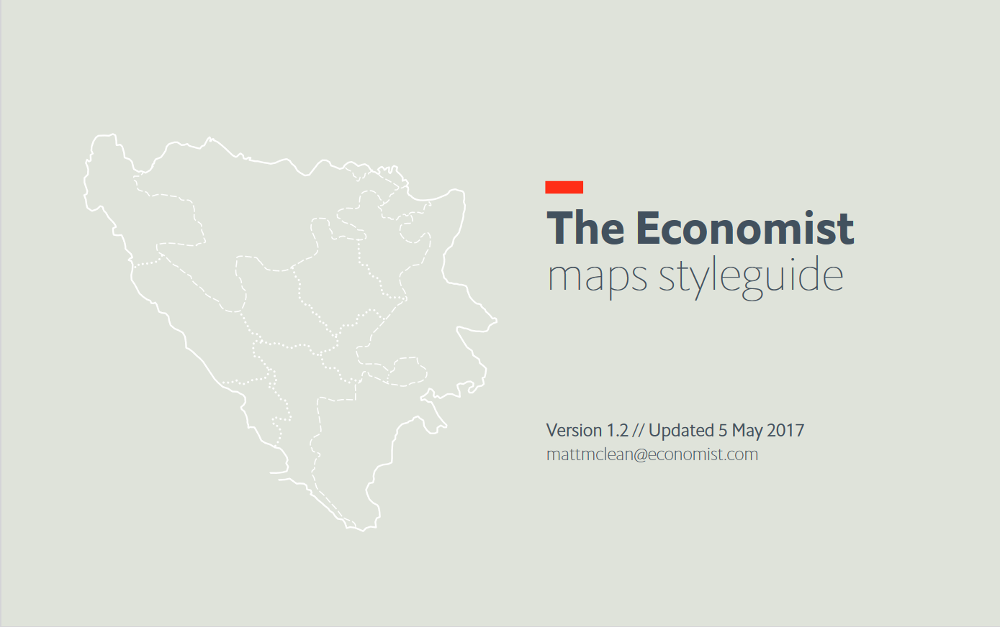
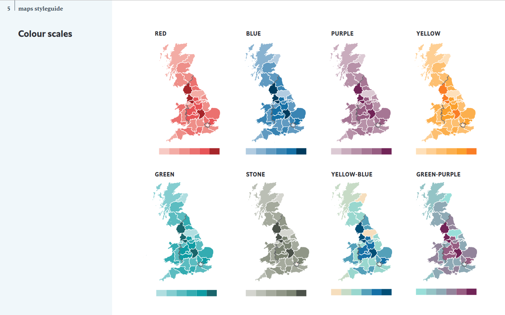

It's quite hard to find examples of good mapping guidelines online - not just the "how to" or generic advice, but comprehensive guidlines about a set of styles an organisation uses. 

The Economist does share theirs online through their design system subsite: [The Economist Maps style guide](https://design-system.economist.com/documents/MAPstyleguide_20170505.pdf).

They're pretty good at sharing these kind of documents, perhaps related to the fact that they sell copies of their writing style guide as a standalone product. 

The guide has sections on: 

  * Text styles
  * Lines and objects
  * Colour palettes
  * Colour scales
  * Locator maps, country-level maps and street maps
  * Map projections

I'd love it if more organisations shared this kind of material from their design systems. Like the Economist, [the Guardian](https://www.theguardian.com/guardian-observer-style-guide-a) and the [BBC](https://www.bbc.co.uk/newsstyleguide/) also share their writing style guides online but both are missing any material on maps.
